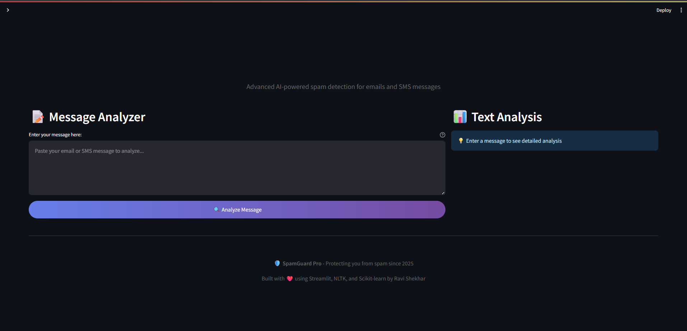
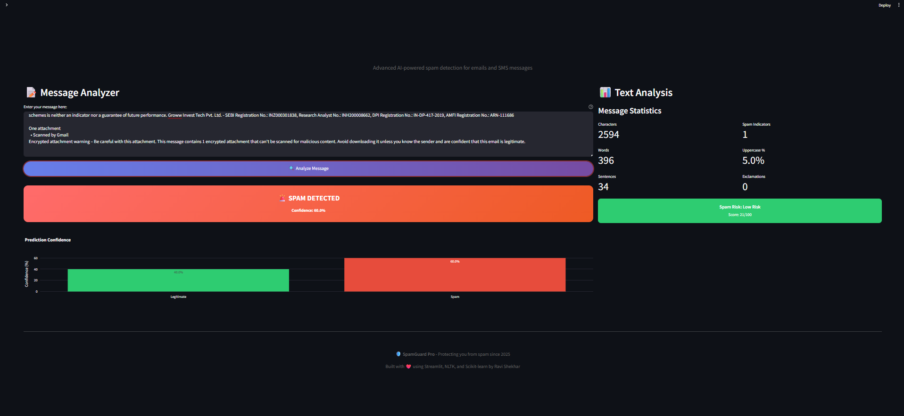

# Email/SMS Spam Classifier

## Table of Contents
- [Introduction](#introduction)
- [Screenshots](#screenshots)
- [Deployed Website](#deployed-website)
- [Features](#features)
- [Technologies Used](#technologies-used)
- [Installation](#installation)
- [Deployment](#deployment)
  - [Important Note About Netlify](#important-note-about-netlify)
  - [Streamlit Sharing](#streamlit-sharing-recommended)
  - [Heroku](#heroku-deployment)
  - [Docker](#docker-deployment)
- [Contributions](#contributions)
- [License](#license)

## Introduction

The main objective behind this application is to classify SMS/Email as spam or not spam using machine learning. With an ever-growing demand to communicate in professional settings such as institutes and workplaces, especially during times when remote communication became essential, the risk of encountering spam has significantly increased.

Unfortunately, this environment also provides fertile ground for spammers who exploit it to execute fraudulent activities. To combat this, our application utilizes Python, a powerful tool for building machine learning models, to help distinguish spam from legitimate messages. By automating the detection of spam, this application contributes to reducing cybercrimes and simplifying the digital lives of users.

The project leverages **Naive Bayes Classifiers**, a family of algorithms based on Bayes' Theorem, which presumes independence between predictive features. This theorem is crucial for calculating the likelihood of a message being spam based on various characteristics of the data.

## Screenshots

Here are some screenshots of the application:


*Home Page of the Spam Classifier*


*Displaying a not spam classification result*


*Displaying a spam classification result*

## Deployed Website

The classifier is accessible online at [Spam Classifier Web App](). Users can test the functionality by submitting text to be classified in real-time.

## Features

- **Real-Time Spam Detection:** Quickly classify whether messages are spam.
- **User-Friendly Interface:** Easy-to-use interface built with Streamlit.
- **High Accuracy:** Employs Naive Bayes Classifier for high reliability.
- **Data Visualization:** Integrates graphical representations of data analytics.
- **Multi-Format Support:** Capable of analyzing both emails and SMS.

## Technologies Used

**Programming Language:** 
- Python

**Environment:**
- Jupyter Notebook
- Pycharm

**Modules:**
1. **Streamlit** - For the graphical user interface.
2. **numpy, pandas** - For data pre-processing.
3. **matplotlib, seaborn, wordcloud** - To represent data through graphs.
4. **nltk** - To work with human language data.
5. **sklearn** - To build the machine learning model.
6. **pickle** - To export the efficient machine learning model.
7. **time** - To delay function calls.

## Installation

### Prerequisites
Before installing the application, ensure you have the following installed on your machine:
- Python (3.8 or newer)
- pip (Python package installer)

### Steps
To get the Spam Classifier up and running locally on your machine, please follow the steps below:

1. **Clone the repository:**
   ```
  git clone https://github.com/RaviShekharrepo/Email-SMS-Spam-Classifier.git
   cd email-sms-spam-classifier
   ```
2. **Install required Python packages:**
   ```
   pip install -r requirements.txt
   ```
3. **Download NLTK data:**
   ```
   python -m nltk.downloader stopwords punkt
   ```
4. **Run the Streamlit application:**
    ```
    streamlit run app.py
    ```
5. **Alternative command to run the app:**
   ```
   python -m streamlit run app.py
   ```

## Deployment

### Important Note About Netlify

**Streamlit applications have specific server requirements that are not compatible with Netlify's serverless function architecture.** While this project includes Netlify configuration files, the application cannot run directly on Netlify due to these technical limitations.

When deployed to Netlify, visitors will see a landing page with instructions on how to properly deploy the application using recommended platforms.

### Streamlit Sharing (Recommended)

Streamlit Sharing is the easiest and most appropriate way to deploy Streamlit applications:

1. Fork this repository to your GitHub account
2. Go to [share.streamlit.io](https://share.streamlit.io)
3. Sign in with your GitHub account
4. Click "New app"
5. Select this repository
6. Set the main file path to `app.py`
7. Click "Deploy"

### Heroku Deployment

This application includes a `Procfile` for Heroku deployment:

1. Install the [Heroku CLI](https://devcenter.heroku.com/articles/heroku-cli)
2. Create a Heroku app:
   ```
   heroku create your-app-name
   ```
3. Set the Python buildpack:
   ```
   heroku buildpacks:set heroku/python
   ```
4. Deploy:
   ```
   git push heroku main
   ```

### Docker Deployment

A Dockerfile is provided for containerized deployment:

1. Build the Docker image:
   ```
   docker build -t spam-classifier .
   ```
2. Run the container:
   ```
   docker run -p 8501:8501 spam-classifier
   ```
3. Access the application at `http://localhost:8501`

## Contributions

Contributions are welcome! We value your input and appreciate your help in making the app even better.

## License

This project is covered under the MIT License. See the [LICENSE](LICENSE.txt) file for more information.
